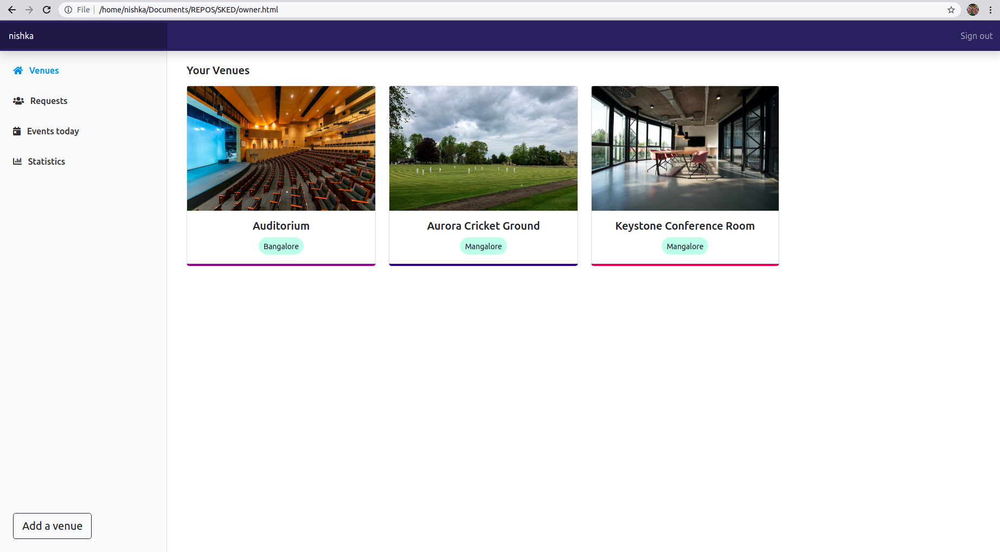
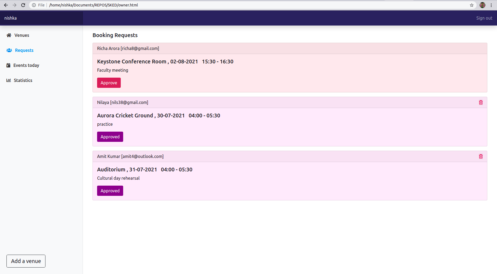
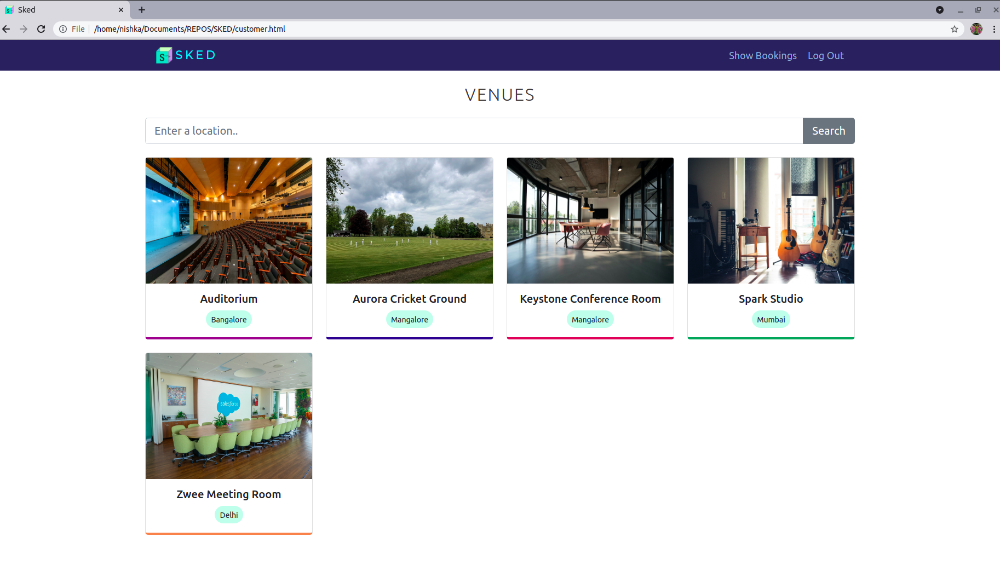

# SKED

A full-stack venue booking web application built using Parse and SashiDo.It has two main types of users ie. Customers and Venue owners.

A customer can :

- Find details about venues and filter them based on location  
- Check time slots that have already been booked for any day  
- Send a booking request to the owner of that venue  

An owner can :  

- Add a venue  
- Get bookings made for the present day  
- Approve booking requests made by customers  
- Delete bookings for events that have finished  

Demo video : https://youtu.be/CUpRyOhE7kM

Tutorial to build this project can be found here - [Part-1](https://dev.to/nishkakotian/building-a-venue-booking-system-using-parse-and-sashido-part-1-569k), [part-2](https://dev.to/nishkakotian/building-a-venue-booking-system-using-parse-and-sashido-part-2-3mdb)

I've added a few demo images below.Check the Screenshots folder for more!

## Owner Dashboard

## Customer Dashboard

## Venue Details Page demo

